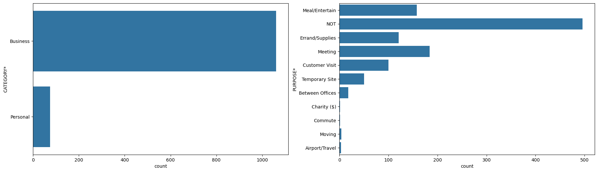
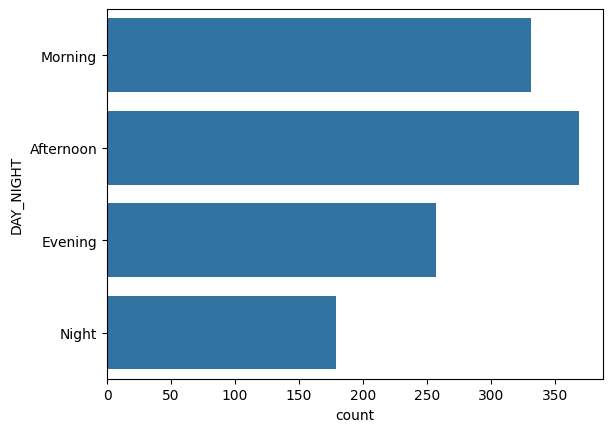
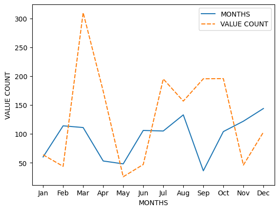
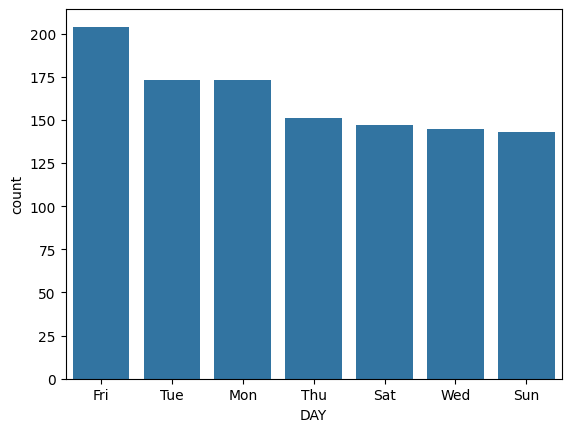
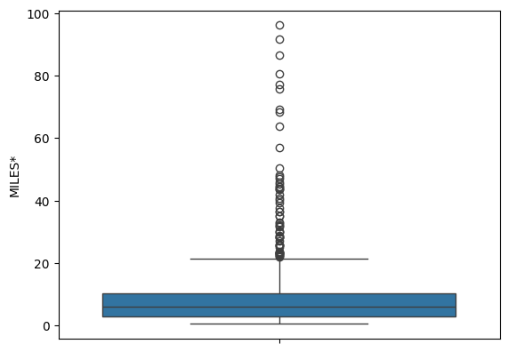
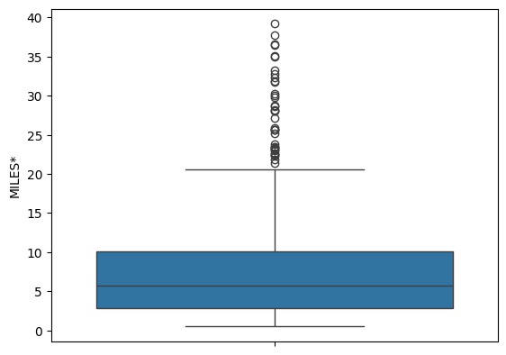
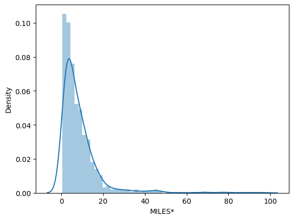

# Ride-Hailing-Driver-Data-Analysis

## Overview
This project focuses on analyzing Uber ride data to uncover insights into customer travel behavior, trip duration, and peak travel times. The analysis leverages Python libraries to clean data and visualize trends, providing actionable insights.

## Key Features

1. **Data Cleaning and Exploratory Data Analysis (EDA)**  
   - Utilized **Python (Pandas)** for cleaning data and addressing missing values in a dataset of **200 samples**.  
   - Conducted **Exploratory Data Analysis (EDA)** to understand key patterns in the data.

2. **Customer Travel Behavior Insights**  
   - Identified primary purposes for Uber rides, with **work-related trips** being the most common purpose.  
   - Created additional columns to analyze trip duration, finding that most rides lasted between **20-30 minutes**.

3. **Peak Travel Times and Seasonal Trends**  
   - Determined that the majority of rides occurred in the **afternoon**, with **350 samples** analyzed.  
   - Found peak travel months to be **September to December**, with **150 samples** recorded during this period.  
   - Analyzed peak travel days, identifying **weekends** as the most popular, with **200 samples**.

## Tools and Techniques
- **Data Cleaning**: Python (Pandas).  
- **Data Visualization**: Seaborn for charts and trend analysis.  
- **Key Metrics**: Trip duration, peak travel times, and ride purposes.

## Insights
- Work-related trips dominate Uber usage, highlighting a key customer segment.  
- Afternoon and weekend rides are most common, aligning with leisure and work schedules.  
- Seasonal trends show increased travel demand from September to December.

## Future Scope
- Incorporate a larger dataset for more comprehensive analysis.  
- Use predictive modeling to anticipate peak travel times and durations.  
- Explore regional differences in ride purposes and durations.

## Screenshots

